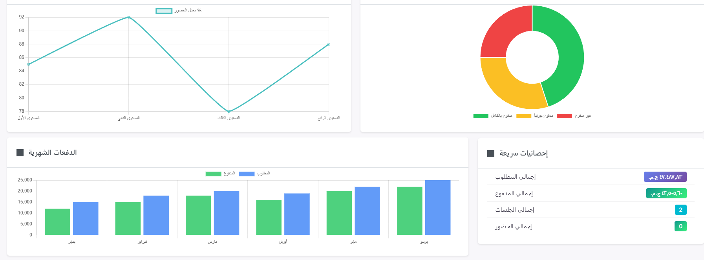

#CourseHub - Student Course Management System

CourseHub is a comprehensive platform for managing student registration, personal data, teachers, teaching schedules, courses, payments, and academic packages. It also provides **detailed reporting and analytics** for administrators.

---

## Overview
**Industry:** Education / Online Training  
**Role:** Principal Software Engineer & Full-Stack Lead  
**Users:** Students, Teachers, Administrative Staff  

### Business Problem
Educational institutions and training centers struggled with:
- Manual student registration and course enrollment  
- Disorganized schedules and teacher assignments  
- Inaccurate payment tracking for courses and packages  
- Lack of consolidated reporting for administrators  

---

## Key Features
- Student registration and personal data management  
- Teacher profiles and schedule assignments  
- Course creation, enrollment, and session scheduling  
- Payment tracking for courses and packages  
- Dynamic timetable management and notifications  
- Reports: student progress, attendance, payments, and package usage  
- Role-based access control for students, teachers, and admin staff  

---

## Architecture & Technologies
- **Frontend:** Vue.js (Vue 3, Composition API), Pinia, Bootstrap  
- **Backend:** Django, Django REST Framework (DRF)  
- **Database:** MySQL  
- **Async Tasks:** Celery + Redis (for notifications, report generation)  
- **Infrastructure / Deployment:** Docker, AWS EC2, S3, RDS  
- **CI/CD:** GitHub Actions  

 

---

## Key Achievements
- Built a **modular full-stack system** enabling rapid course creation and management  
- Implemented **dynamic scheduling** for teachers and classrooms  
- Optimized **payment and package workflows** for students  
- Designed **role-based access control** ensuring security across users  
- Developed **custom reports and dashboards** for administrators  

---

## Impact
- Streamlined student registration and enrollment process  
- Improved administrative efficiency by 40%  
- Enabled real-time schedule updates and notifications for students and teachers  
- Scalable system ready for multiple training centers  

---

## Screenshots / Demo
>   
> *Placeholder for CourseHub dashboard screenshot*

---

## Note on Source Code
This project is enterprise-grade and protected under NDA.  
Source code cannot be shared publicly, but architecture, workflows, and system design are available for discussion.

---

## Contact
📧 ahmedbarakatsamra@gmail.com  
🔗 [LinkedIn](https://www.linkedin.com/in/ahmed-barakat-8b7b9922/)  
🔗 [GitHub](https://github.com/ahmedbarkat)
